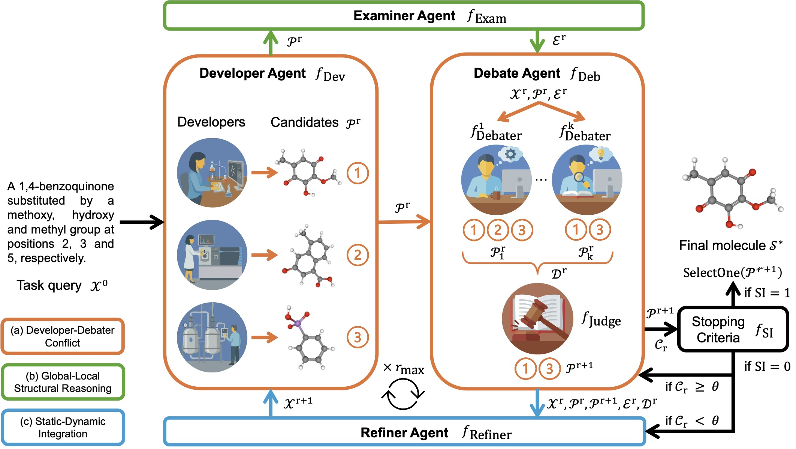

# Mol-Debate: Multi-Agent Debate Improves Structural Reasoning in Molecular Design

[Wengyu Zhang](https://wengyuzhang.com), [Xiao-Yong Wei](https://www4.comp.polyu.edu.hk/~x1wei/) and [Qing Li](https://www4.comp.polyu.edu.hk/~csqli/)

[](https://arxiv.org/abs/2604.20254) [](https://github.com/wyuzh/Mol-Debate) 

[**Paper PDF**](https://arxiv.org/pdf/2604.20254)

Official implementation of "Mol-Debate: Multi-Agent Debate Improves Structural Reasoning in Molecular Design".

<p align="center"></p>

## 📢 News

- **[2026.4.29]** The source code of Mol-Debate has been released.
- **[2026.4.22]** The code repository of Mol-Debate has been created. The source code will be released soon.


<a name="installation"></a>

## ⚙️ Installation

1. Clone the repository from GitHub.

```shell
git clone https://github.com/wyuzh/Mol-Debate
cd Mol-Debate
```

2. Create conda environment.

```shell
conda create -n mol-debate python=3.11
conda activate mol-debate
```

3. Install packages.
```shell
pip install -r requirements.txt
```

<a name="dataset"></a>

## 🗂️ Dataset

### 1. ChEBI-20

Download the three split files of ChEBI-20 dataset [here](https://github.com/phenixace/MolReGPT/tree/main/dataset/cap_mol_trans/raw) and place them under `ChEBI-20/cap2mol_trans_raw/`:

```
ChEBI-20/
└── cap2mol_trans_raw/
    ├── train.txt
    ├── validation.txt
    └── test.txt
```

### 2. S2-Bench

Download the S2-Bench dataset from [here](https://huggingface.co/datasets/Duke-de-Artois/TOMG-Bench) and place the dataset files under `S2-Bench/data/`:

```text
S2-Bench/
└── data/
    ├── benchmarks/
    │   ├── open_generation/
    │   │   ├── MolCustom/
    │   │   ├── MolEdit/
    │   │   └── MolOpt/
    │   └── targeted_generation/
    ├── OpenMolIns/
    └── sources/
```

<a name="run"></a>

## 🚀 Run 

### 1. Start vLLM server

Start vLLM server for the three models from huggingface.
- [weidawang/Chem-R-8B](https://huggingface.co/weidawang/Chem-R-8B)
- [OpenDFM/ChemDFM-R-14B](https://huggingface.co/OpenDFM/ChemDFM-R-14B)
- [OpenDFM/ChemDFM-v1.5-8B](https://huggingface.co/OpenDFM/ChemDFM-v1.5-8B)

```bash
# Single GPU
NCCL_P2P_DISABLE=1 vllm serve weidawang/Chem-R-8B --host 0.0.0.0 --port 8120
NCCL_P2P_DISABLE=1 vllm serve OpenDFM/ChemDFM-R-14B --host 0.0.0.0 --port 8121
NCCL_P2P_DISABLE=1 vllm serve OpenDFM/ChemDFM-v1.5-8B --host 0.0.0.0 --port 8122
```

```bash
# Or on multiple GPUs
NCCL_P2P_DISABLE=1 CUDA_VISIBLE_DEVICES=0,1 vllm serve weidawang/Chem-R-8B --tensor-parallel-size 2 --host 0.0.0.0 --port 8120
NCCL_P2P_DISABLE=1 CUDA_VISIBLE_DEVICES=2,3 vllm serve OpenDFM/ChemDFM-R-14B --tensor-parallel-size 2 --host 0.0.0.0 --port 8121
NCCL_P2P_DISABLE=1 CUDA_VISIBLE_DEVICES=4,5 vllm serve OpenDFM/ChemDFM-v1.5-8B --tensor-parallel-size 2 --host 0.0.0.0 --port 8122
```

### 2. Setup Azure OpenAI API

Get the API base url and API key from [Azure OpenAI](https://azure.microsoft.com/en-us/products/ai-foundry/)

```bash
export OPENAI_API_BASE=<your-api-base-url>
export OPENAI_API_KEY=<your-api-key>
```

### 3. Run Mol-Debate on ChEBI-20

```bash
bash ./ChEBI-20/script/run_debate.sh
```

Evaluate the results of Mol-Debate on ChEBI-20:

```bash
bash ./ChEBI-20/script/run_eval.sh
```

The results will be saved in the `./ChEBI-20/results/Mol-Debate_ChEBI-20/` folder.

### 4. Run Mol-Debate on S2-Bench


```bash
bash ./S2-Bench/script/run_debate.sh
```

Evaluate the results of Mol-Debate on S2-Bench

```bash
bash ./S2-Bench/script/run_eval.sh
```

The results will be saved in the `./S2-Bench/predictions_debate/Mol-Debate_S2-Bench` folder.

## 📋 TODO
- [x] Create the repository;
- [x] Release the source code;


## 📖 Citation
If you find the repository or the paper useful, please use the following entry for citation.

```
@article{zhang2026mol,
  title={Mol-Debate: Multi-Agent Debate Improves Structural Reasoning in Molecular Design},
  author={Zhang, Wengyu and Wei, Xiao-Yong and Li, Qing},
  journal={arXiv preprint arXiv:2604.20254},
  year={2026}
}
```


## Acknowledgement

- [vLLM](https://github.com/vllm-project/vllm): the LLM server we used.
- [MolReGPT](https://github.com/phenixace/MolReGPT), [TOMG-Bench](https://github.com/phenixace/TOMG-Bench): the codebase we built upon.